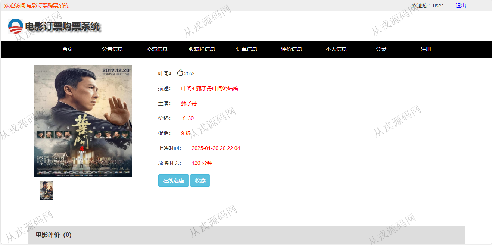
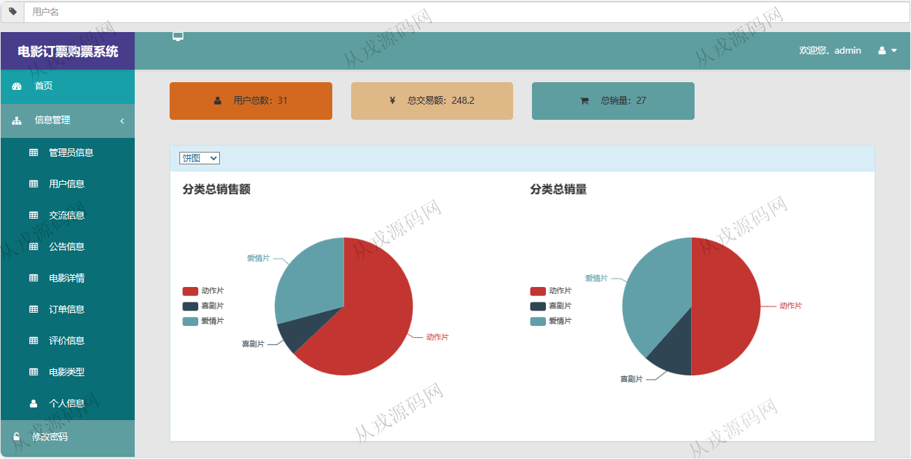

<h1 align="center">193.电影订票购票管理系统</h1>

 获取sql文件 QQ: 386869957 QQ群: 377586148 

 [更多源码项目: 从戎源码网](https://armycodes.com/) 

## 简介

> 本代码来源于网络,仅供学习参考使用!
>
> 提供1.远程部署/2.修改代码/3.设计文档指导/4.框架代码讲解等服务
> 
> http://localhost:8888/front/index.html
> 
> admin 123456
> 
> user 123456
>

## 项目介绍
基于springboot的电影订票购票管理系统：前端 html、jquery，后端 maven、springmvc、spring、mybatis；角色分为管理员、用户；集成电影选票、在线选座、付款、我的订单查询等功能于一体的系统。

## 功能介绍

### 用户

- 基本功能：登录，注册，退出
- 网站首页：主导航栏，全局搜索，轮播图，电影分类展示，推荐电影，热映电影
- 电影购买：电影详情，收藏，取消收藏，点赞，评价，在线选座，付款
- 订单信息：订单列表查询，订单删除，订单状态查询
- 其它功能：交流信息，收藏栏信息，个人信息查看与修改，充值

### 管理员

- 用户信息：用户信息由用户前台自行注册，管理员可以增删改查操作
- 公告信息：公告信息的增删改查，内容关键词搜索
- 电影详情：电影信息的增删改查，上架，下架操作
- 订单信息：管理员可以查询用户的订单数据，已观看和删除操作
- 电影类型：类型信息的增删改查
- 评价信息：对用户的评价信息进行查看和删除

## 环境

- <b>IntelliJ IDEA 2021.3</b>

- <b>Mysql 5.7.26</b>

- <b>JDK 1.8</b>

## 运行截图

